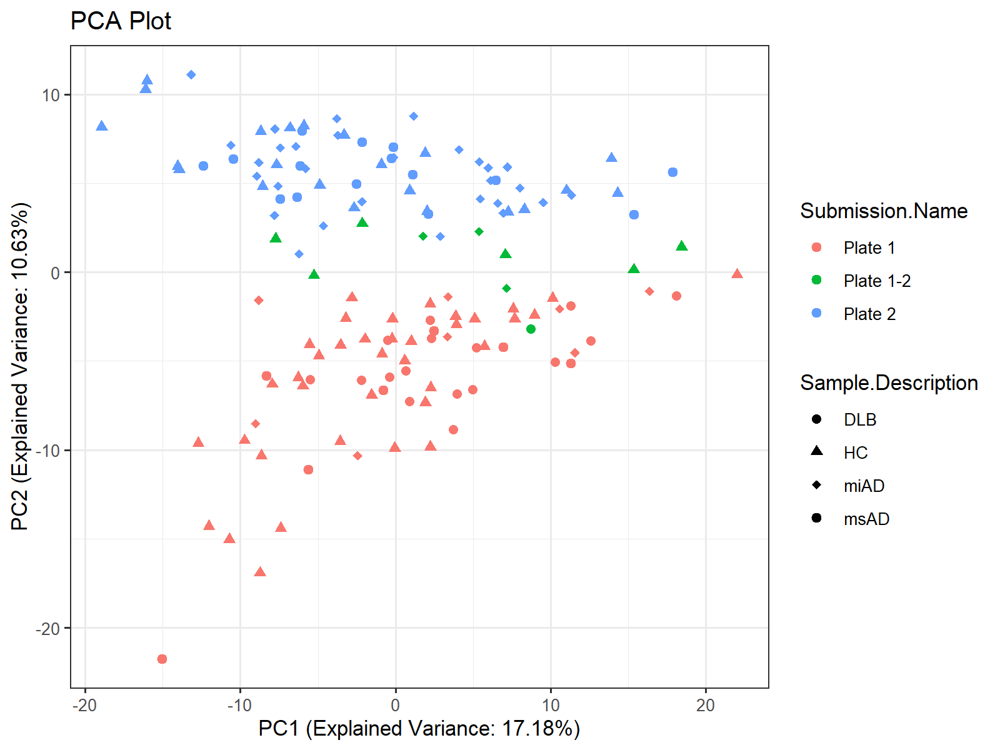
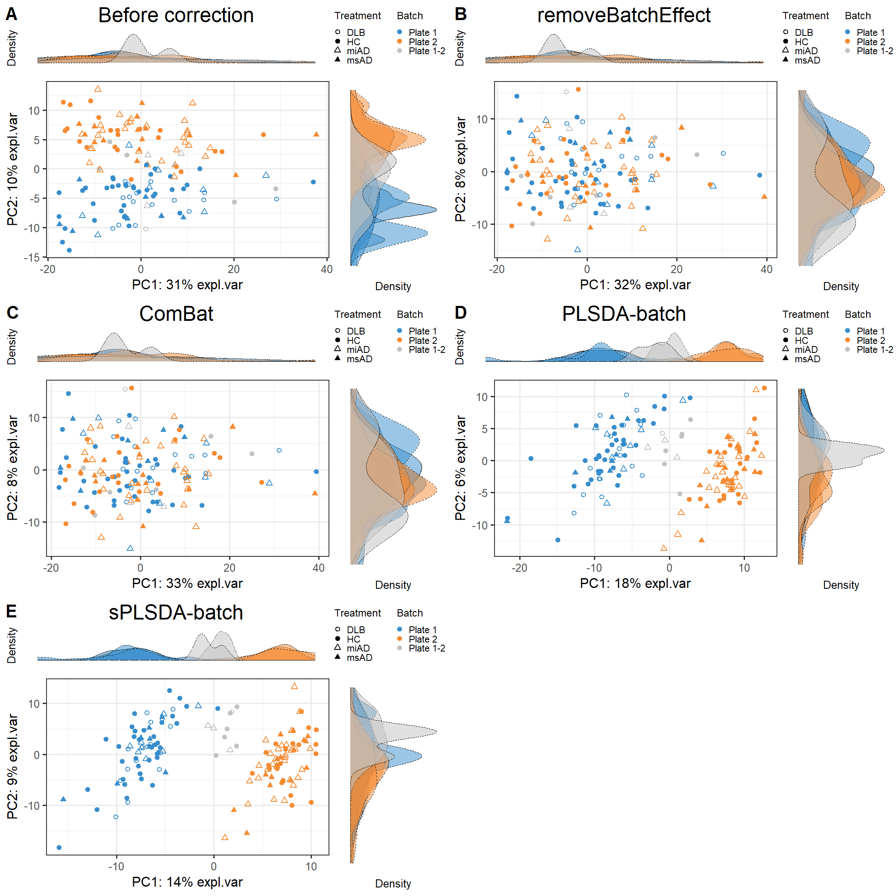

<!-- README.md is generated from README.Rmd. Please edit that file -->

# dataPreparation

<!-- badges: start -->
<!-- badges: end -->

## Data Processing Phase 1 Report

This report outlines the data processing steps involved in phase 1. It
covers various preprocessing tasks such as reformatting material names,
adding missing phenotype data, selecting metadata, deduplication,
imputation of missing values, and performing principal component
analysis (PCA).

e.g.:

<figure>

<figcaption aria-hidden="true">Figure 1: pca_plot</figcaption>
</figure>

## Data Processing Phase 2 Report

This report focuses on the data processing steps involved in phase 2. It
encompasses filtering the data, transforming it using Compositional
Log-Ratio (CLR) transformation, assessing batch effects, and applying
batch correction methods such as removeBatchEffect, ComBat, PLSDA-batch,
sPLSDA-batch, and percentile normalization.

  

<figure>

<figcaption aria-hidden="true">Figure 2: batch_correction2</figcaption>
</figure>

<figure>

<figcaption aria-hidden="true">Figure 3: batch_correction1</figcaption>
</figure>
